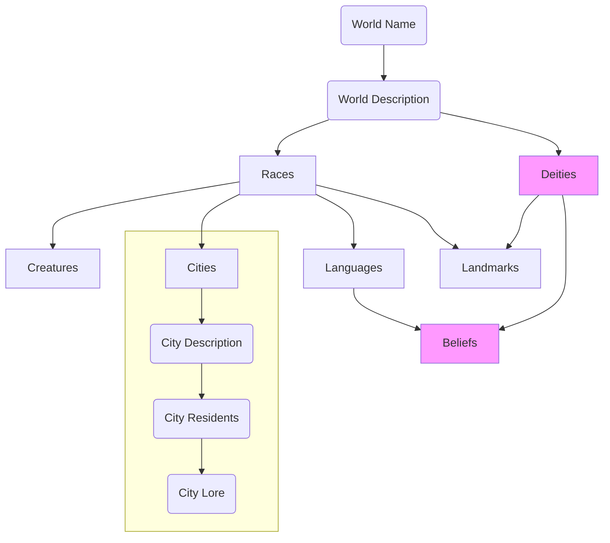

# Mythical Mentor
Use AI to generate works and mythos automatically

```mermaid
flowchart TD
    WName(World Name) --> WorldDesc(World Description)
    WorldDesc --> Races
    Races --> Creatures
    Races --> Cities
    Races --> Languages
    WorldDesc --> Deities
    style Deities fill:#f9f

    Deities --> Landmarks
    Races --> Landmarks

    Deities --> Beliefs
    Languages --> Beliefs
    style Beliefs fill:#f9f

    subgraph city [ ]
      Cities --> CITY1(City Description)
      CITY1 --> CITY2(City Residents)
      CITY2 --> CITY3(City Lore)
    end
```