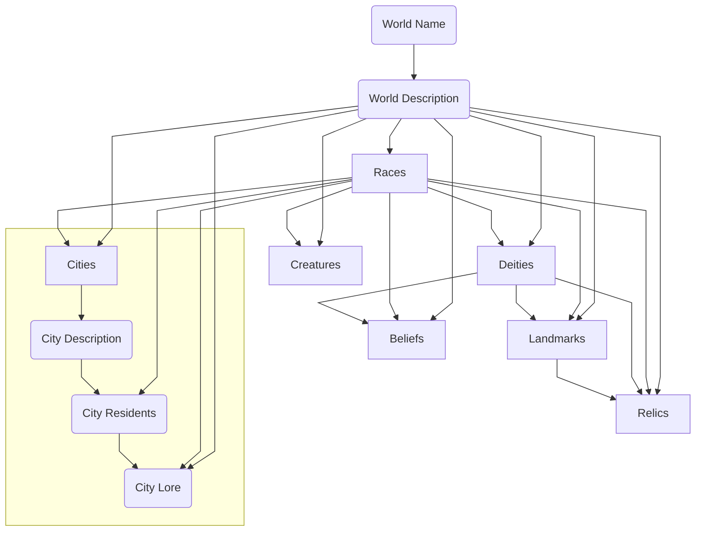

# Mythical Mentor
Use AI to generate worlds and mythos automatically.

```mermaid
%%{ init : { "theme" : "default", "flowchart" : { "curve" : "linear" }}}%%

flowchart TD
    WName(World Name) --> WorldDesc(World Description)
    WorldDesc --> Races
    WorldDesc --> Creatures
    WorldDesc --> Landmarks
    WorldDesc --> Deities
    WorldDesc --> Cities
    WorldDesc --> Beliefs
    WorldDesc --> Relics
    WorldDesc --> CITY3

    Races --> Creatures
    Races --> Cities
    Races --> Deities
    Races --> Beliefs
    Races --> Relics
    Races --> CITY2
    Races --> CITY3
    Races --> Landmarks

    Deities --> Beliefs
    Deities --> Landmarks
    Deities --> Relics

    Landmarks --> Relics

    subgraph city [ ]
      Cities --> CITY1(City Description)
      CITY1 --> CITY2(City Residents)
      CITY2 --> CITY3(City Lore)
    end
```

### To do

+ Allow for different SD models
+ Add in real hyperlinks in the app